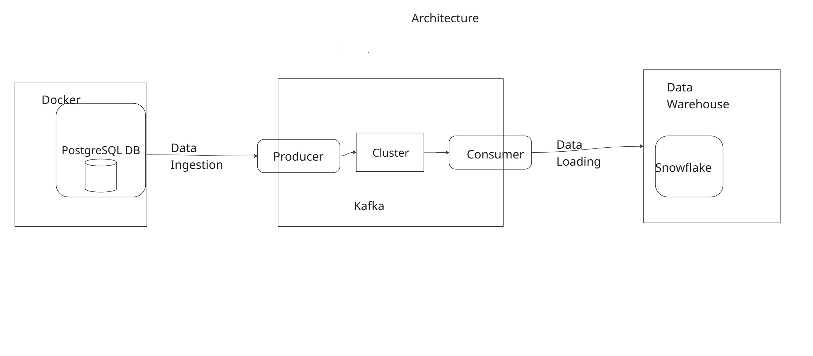

# Real-Time Data Processing with Confluent Kafka, PostgreSQL, and Avro

## Objective
This project demonstrates a real-time data pipeline built using Python, Confluent Kafka, PostgreSQL, and Avro serialization. 
The core objective is to stream incremental data updates from a PostgreSQL database table to a Kafka topic, process this data with a consumer group, and then store the deserialized information in separate JSON files.

## Background: BuyOnline E-commerce Data Pipeline
In a fictitious e-commerce company named "BuyOnline," product information (including product ID, name, category, price, and updated_timestamp) is stored in a PostgreSQL database. This database undergoes frequent updates with new products and changes to existing product details. To facilitate real-time analytics and business intelligence, BuyOnline aims to develop a system that incrementally streams these updates to downstream systems.
This project implements a solution to achieve this real-time data streaming.

## Tools and Technologies
- Python 3.7+: The primary programming language for the producer and consumer applications.
- Confluent Kafka Python Client (confluent-kafka): For interacting with Kafka brokers and Schema Registry.
- PostgreSQL Database: The source system for product data.
- psycopg2: Driver for connecting to PostgreSQL.
- Apache Avro: Data serialization format. The confluent-kafka client handles Avro serialization/deserialization seamlessly with the Schema Registry.
- Confluent Schema Registry: Centralized repository for managing Avro schemas.
- Snowflake: Data Warehouse